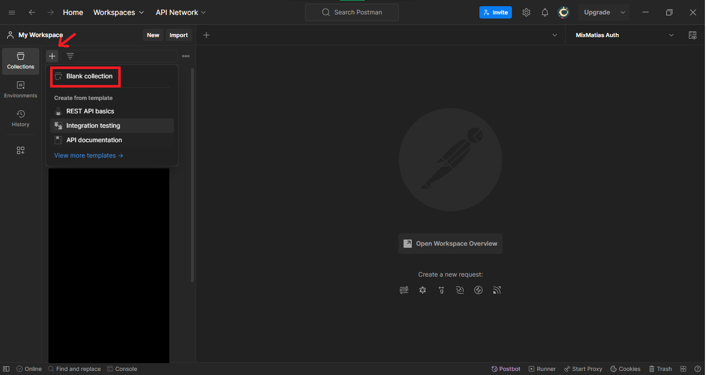
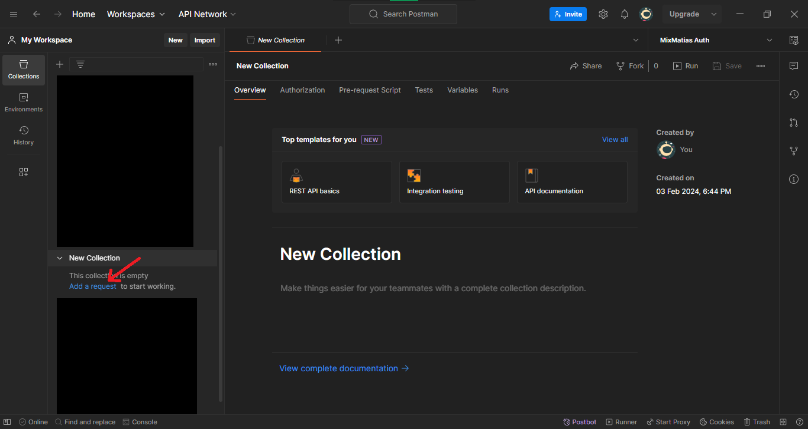
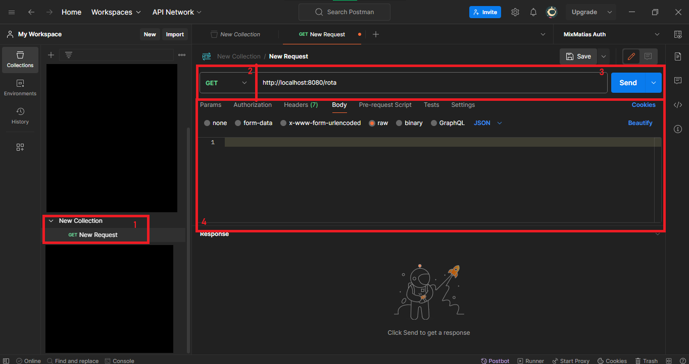

# Desafio Back-End (PicPay)
<h1> Picpay Simplificado </h1>


Este repositório contém uma solução de um desafio proposto por [PicPay](https://picpay.com/). O objetivo principal da aplicação é facilitar as transferências entre usuários. Existem dois tipos de usuários, os usuários comuns e os lojistas, somente usuários comuns podem fazer transferências enquanto que os lojistas só recebem.

## Estrutura do Repositório

O repositório está organizado na branch **main**, contendo todos os arquivos e commits para cada feature. 

## Pré-requisitos

Certifique-se de ter as seguintes dependências instaladas em sua máquina antes de executar a solução:

- Java (versão 17 ou superior)
- Apache Maven

## Executando a Solução

Siga as etapas abaixo para executar a solução localmente:

1. Clone este repositório em sua máquina local usando o comando:

   ```
   git clone https://github.com/MathiasNeto/desafio-picpay.git
   ```
2. Após fazer os passos acima, você deve mudar as configurações de perfis
   ```
   aplication-test-demo.aplication
   ```
   ```
   aplication-dev-demo.aplication
   ```
   ```
   aplication-prod-demo.aplication
   ```
2. Execulte a aplicação em sua IDE de preferência.

## Uso

Após seguir as etapas acima para iniciar a aplicação, você pode enviar requisições para a API, para isso, uma dica bem interessante é você ter instalado a ferramenta Postman ou Insomnia, o qual permite testar APIs WEB:

Considerando que você já tenha o umas das duas ferramentas instalado na sua máquina, vamos lá:

- Utilizei o Postman, clique no **+**, onde a seta está apontando e depois clique em **Blank collection** ou **Coleção em Branco**:


- Depois de feito o passo acima, você vai clicar em **add request** ou **Adicionar Requisição** onde a seta está indicando:


- Após concluir o passo acima, você verá que foi criado uma Requisição


- De acordo com o que você deseja realizar, basta mudar o tipo da resquisição **GET, POST, PUT, DELETE**, ilustrado com o número **2**. mudar a rota, ilustrada com o número **3**

- Se a resquisição for do tipo **POST**, certifique-se de que está incluido o Payload - conteúdo da rquisição.
- **Exemplo pro Payload**:
```
Tipo da requisição: POST
rota: http://localhost:8080/transaction
```
```
{
    "amount" : 100.0,
    "received_id": 2, 
    "sender_id": 1
}
```
- Por fim, verifique tudo e clique em **SEND**.

- Nesta API, seguindo o que o desafio propôs a fazer, disponibilizei dois Endpoints gerais:
1. Endpoint ``/User``: Este Endpoint fornece recursos para salvar usuários logistas quanto os usuários comuns, busca todos os usuários e busca um único usuário.
2. Endpoint ``/Transaction``: Este Endpoint fornece o recurso para iniciar uma transação.


## Contribuição

Se você deseja contribuir para este projeto, siga as etapas abaixo:

1. Fork este repositório.
2. Crie um branch para sua contribuição:

   ```
   git checkout -b minha-contribuicao
   ```

3. Faça suas alterações e faça commit delas:

   ```
   git commit -m "Minha contribuição"
   ```

4. Envie suas alterações para o seu fork:

   ```
   git push origin minha-contribuicao
   ```

5. Abra um Pull Request neste repositório original.

## Licença

Este projeto está licenciado sob a Licença MIT. Consulte o arquivo [LICENSE](LICENSE) para obter mais informações.

## Contato

Se você tiver alguma dúvida ou sugestão em relação a este projeto, entre em contato comigo através do meu e-mail: [matias.neto.edu@gmail.com](Matias:matias.neto.edu@gmail.com).

Espero que este **README** forneça informações úteis sobre o projeto e como executá-lo. Sinta-se à vontade para personalizar o conteúdo de acordo com as necessidades do seu repositório.
